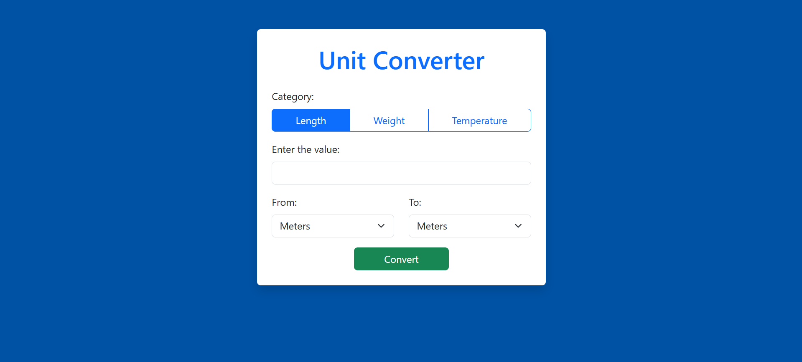
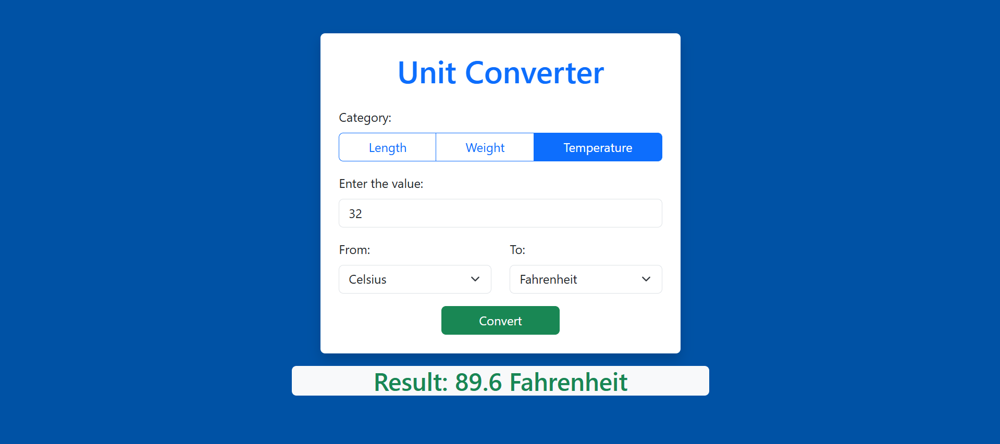

## Link to Project

[https://roadmap.sh/projects/unit-converter](https://roadmap.sh/projects/unit-converter)

## Files

1. index.html
2. main.py

## Technologies

<!-- create badges -->

## Run the code

1. Clone the folder
2. Install the requirements 
    <code> pip install -r requirements.txt </code>
3. Start the uvicorn server
    <code> uvicorn main:app --host "0.0.0.0" --port 8000 --reload </code>
4. Run the index.html

## Output

----
This project is part of the backend projects on the roadmap.sh, [Click here](https://roadmap.sh/projects/unit-converter)
